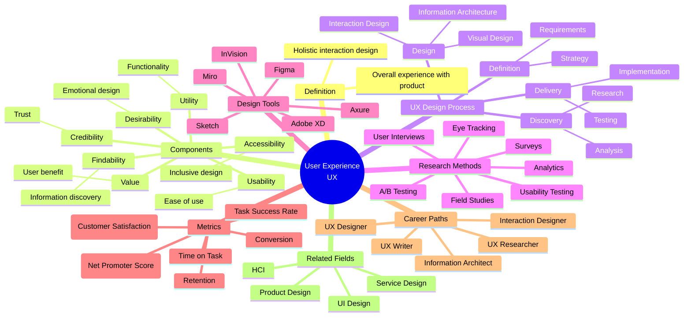

```mermaid
mindmap
  root((User Experience<br/>UX))
    Definition
      Overall experience with product
      Holistic interaction design
    Components
      Usability
        Ease of use
      Utility
        Functionality
      Desirability
        Emotional design
      Accessibility
        Inclusive design
      Credibility
        Trust
      Findability
        Information discovery
      Value
        User benefit
    UX Design Process
      Discovery
        Research
        Analysis
      Definition
        Requirements
        Strategy
      Design
        Information Architecture
        Interaction Design
        Visual Design
      Delivery
        Implementation
        Testing
    Research Methods
      User Interviews
      Surveys
      Analytics
      Usability Testing
      A/B Testing
      Eye Tracking
      Field Studies
    Design Tools
      Figma
      Sketch
      Adobe XD
      InVision
      Axure
      Miro
    Metrics
      Task Success Rate
      Time on Task
      NPS (Net Promoter Score)
      CSAT (Customer Satisfaction)
      Retention
      Conversion
    Career Paths
      UX Researcher
      UX Designer
      Interaction Designer
      Information Architect
      UX Writer
    Related Fields
      UI Design
      Service Design
      Product Design
      HCI
```

