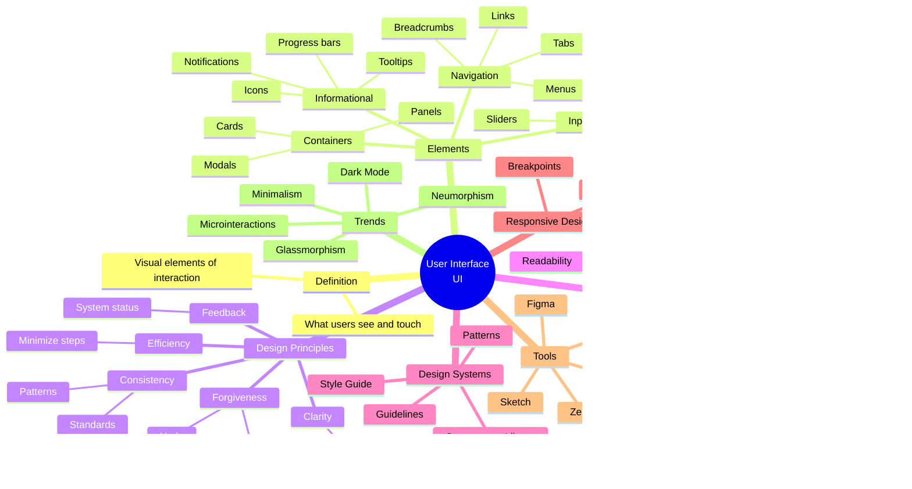

```mermaid
mindmap
  root((User Interface<br/>UI))
    Definition
      Visual elements of interaction
      What users see and touch
    Elements
      Input Controls
        Buttons
        Text fields
        Checkboxes
        Dropdowns
        Sliders
      Navigation
        Menus
        Breadcrumbs
        Tabs
        Links
      Informational
        Tooltips
        Icons
        Progress bars
        Notifications
      Containers
        Cards
        Modals
        Panels
    Design Principles
      Clarity
        Clear purpose
      Consistency
        Patterns
        Standards
      Feedback
        System status
      Efficiency
        Minimize steps
      Forgiveness
        Undo
        Confirmation
    Visual Design
      Layout
        Grid systems
        Spacing
        Alignment
      Typography
        Hierarchy
        Readability
      Color
        Palette
        Contrast
        Meaning
      Imagery
        Icons
        Illustrations
        Photos
    Design Systems
      Components Library
      Style Guide
      Patterns
      Guidelines
    Responsive Design
      Mobile-first
      Breakpoints
      Adaptive layouts
    Tools
      Figma
      Adobe XD
      Sketch
      Zeplin
      InVision
    Trends
      Minimalism
      Dark Mode
      Microinteractions
      Glassmorphism
      Neumorphism
```

