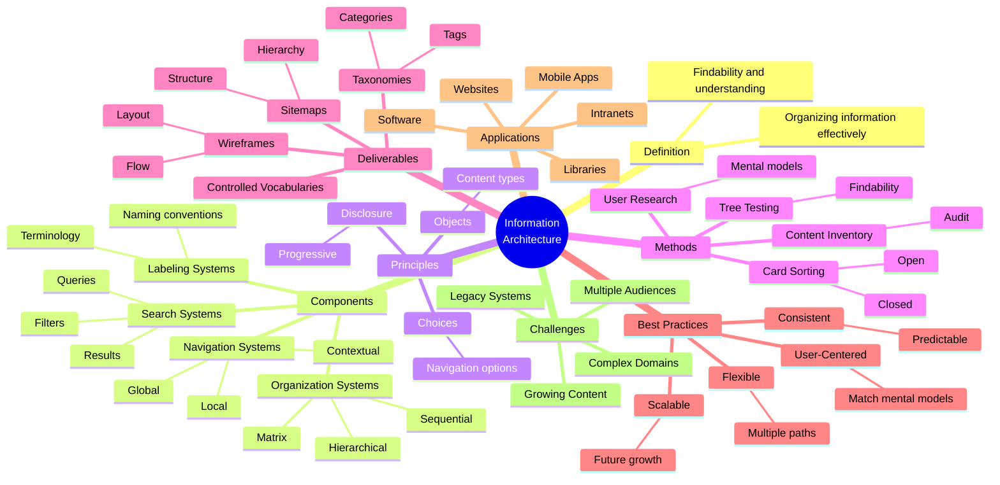

```mermaid
mindmap
  root((Information<br/>Architecture))
    Definition
      Organizing information effectively
      Findability and understanding
    Components
      Organization Systems
        Hierarchical
        Sequential
        Matrix
      Labeling Systems
        Naming conventions
        Terminology
      Navigation Systems
        Global
        Local
        Contextual
      Search Systems
        Queries
        Filters
        Results
    Principles
      Objects
        Content types
      Choices
        Navigation options
      Disclosure
        Progressive
    Methods
      Card Sorting
        Open
        Closed
      Tree Testing
        Findability
      Content Inventory
        Audit
      User Research
        Mental models
    Deliverables
      Sitemaps
        Structure
        Hierarchy
      Wireframes
        Layout
        Flow
      Taxonomies
        Categories
        Tags
      Controlled Vocabularies
    Best Practices
      User-Centered
        Match mental models
      Scalable
        Future growth
      Flexible
        Multiple paths
      Consistent
        Predictable
    Applications
      Websites
      Intranets
      Mobile Apps
      Software
      Libraries
    Challenges
      Growing Content
      Multiple Audiences
      Complex Domains
      Legacy Systems
```

