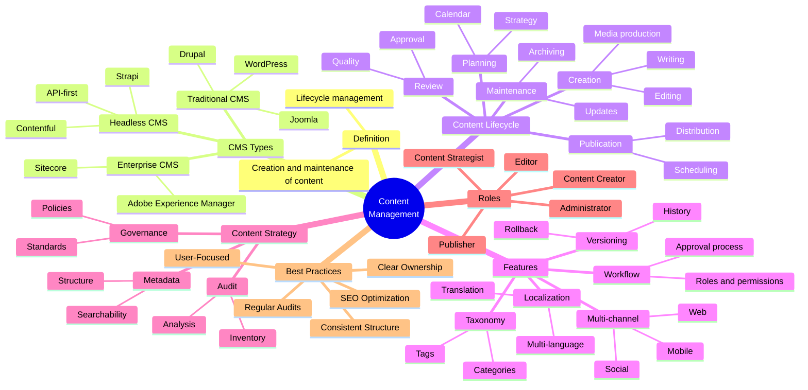

```mermaid
mindmap
  root((Content<br/>Management))
    Definition
      Creation and maintenance of content
      Lifecycle management
    CMS Types
      Traditional CMS
        WordPress
        Drupal
        Joomla
      Headless CMS
        API-first
        Contentful
        Strapi
      Enterprise CMS
        Sitecore
        Adobe Experience Manager
    Content Lifecycle
      Planning
        Strategy
        Calendar
      Creation
        Writing
        Editing
        Media production
      Review
        Approval
        Quality
      Publication
        Scheduling
        Distribution
      Maintenance
        Updates
        Archiving
    Features
      Workflow
        Roles and permissions
        Approval process
      Versioning
        History
        Rollback
      Taxonomy
        Categories
        Tags
      Multi-channel
        Web
        Mobile
        Social
      Localization
        Multi-language
        Translation
    Content Strategy
      Audit
        Inventory
        Analysis
      Governance
        Policies
        Standards
      Metadata
        Structure
        Searchability
    Roles
      Content Strategist
      Content Creator
      Editor
      Publisher
      Administrator
    Best Practices
      Consistent Structure
      Clear Ownership
      Regular Audits
      User-Focused
      SEO Optimization
```

