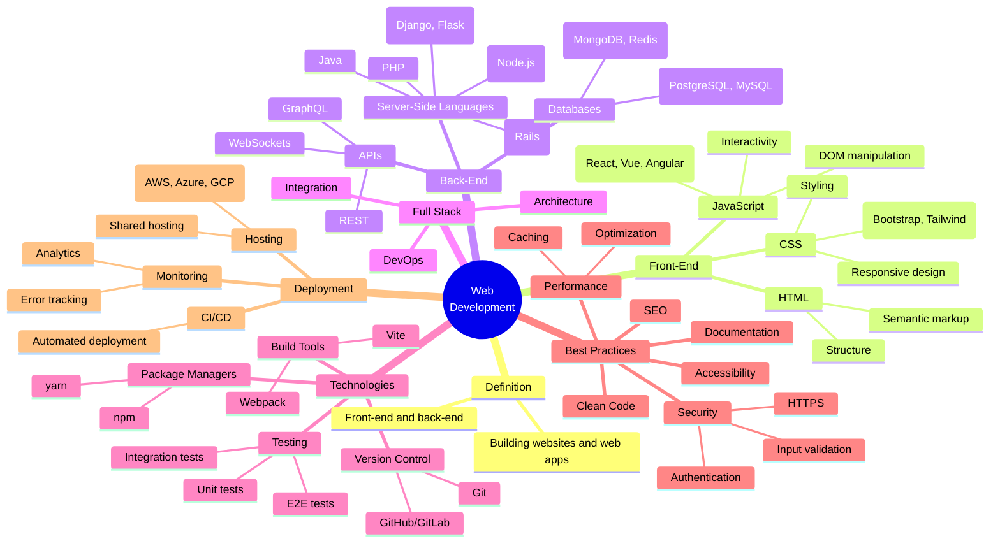

```mermaid
mindmap
  root((Web<br/>Development))
    Definition
      Building websites and web apps
      Front-end and back-end
    Front-End
      HTML
        Structure
        Semantic markup
      CSS
        Styling
        Responsive design
        Frameworks (Bootstrap, Tailwind)
      JavaScript
        Interactivity
        DOM manipulation
        Frameworks (React, Vue, Angular)
    Back-End
      Server-Side Languages
        Python (Django, Flask)
        JavaScript (Node.js)
        PHP
        Ruby (Rails)
        Java
      Databases
        SQL (PostgreSQL, MySQL)
        NoSQL (MongoDB, Redis)
      APIs
        REST
        GraphQL
        WebSockets
    Full Stack
      Integration
      DevOps
      Architecture
    Technologies
      Version Control
        Git
        GitHub/GitLab
      Build Tools
        Webpack
        Vite
      Package Managers
        npm
        yarn
      Testing
        Unit tests
        Integration tests
        E2E tests
    Best Practices
      Clean Code
      Documentation
      Security
        HTTPS
        Input validation
        Authentication
      Performance
        Optimization
        Caching
      Accessibility
      SEO
    Deployment
      Hosting
        Cloud (AWS, Azure, GCP)
        Shared hosting
      CI/CD
        Automated deployment
      Monitoring
        Analytics
        Error tracking
```

