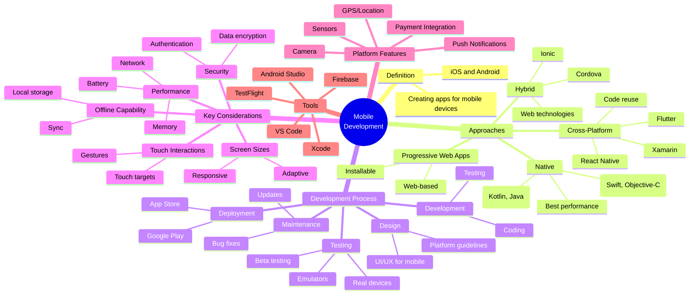

```mermaid
mindmap
  root((Mobile<br/>Development))
    Definition
      Creating apps for mobile devices
      iOS and Android
    Approaches
      Native
        iOS (Swift, Objective-C)
        Android (Kotlin, Java)
        Best performance
      Cross-Platform
        React Native
        Flutter
        Xamarin
        Code reuse
      Hybrid
        Ionic
        Cordova
        Web technologies
      Progressive Web Apps
        Web-based
        Installable
    Development Process
      Design
        UI/UX for mobile
        Platform guidelines
      Development
        Coding
        Testing
      Testing
        Emulators
        Real devices
        Beta testing
      Deployment
        App Store
        Google Play
      Maintenance
        Updates
        Bug fixes
    Key Considerations
      Screen Sizes
        Responsive
        Adaptive
      Touch Interactions
        Gestures
        Touch targets
      Performance
        Battery
        Memory
        Network
      Offline Capability
        Local storage
        Sync
      Security
        Data encryption
        Authentication
    Platform Features
      Push Notifications
      Camera
      GPS/Location
      Sensors
      Payment Integration
    Tools
      Xcode
      Android Studio
      VS Code
      Firebase
      TestFlight
```

