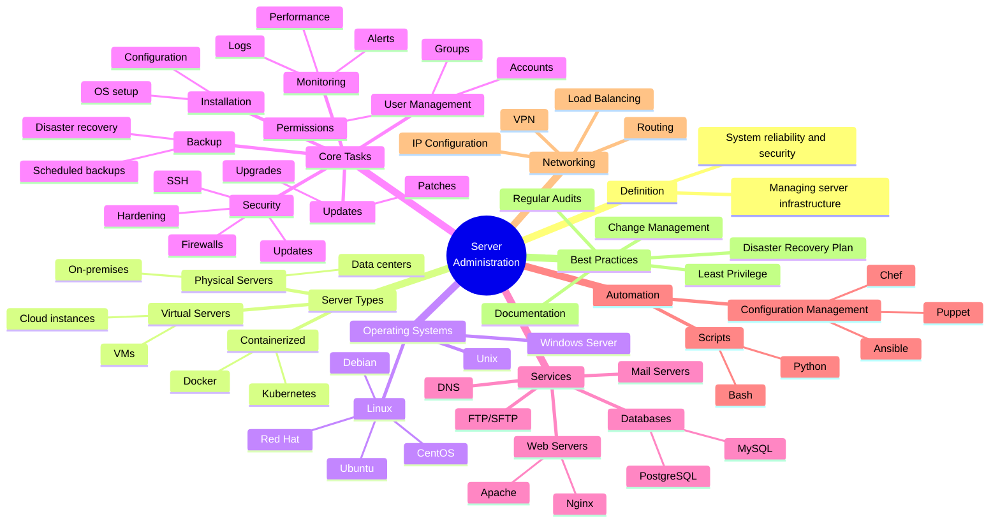

```mermaid
mindmap
  root((Server<br/>Administration))
    Definition
      Managing server infrastructure
      System reliability and security
    Server Types
      Physical Servers
        On-premises
        Data centers
      Virtual Servers
        VMs
        Cloud instances
      Containerized
        Docker
        Kubernetes
    Operating Systems
      Linux
        Ubuntu
        CentOS
        Red Hat
        Debian
      Windows Server
      Unix
    Core Tasks
      Installation
        OS setup
        Configuration
      User Management
        Accounts
        Permissions
        Groups
      Security
        Firewalls
        SSH
        Updates
        Hardening
      Monitoring
        Performance
        Logs
        Alerts
      Backup
        Scheduled backups
        Disaster recovery
      Updates
        Patches
        Upgrades
    Services
      Web Servers
        Apache
        Nginx
      Databases
        MySQL
        PostgreSQL
      Mail Servers
      DNS
      FTP/SFTP
    Automation
      Scripts
        Bash
        Python
      Configuration Management
        Ansible
        Puppet
        Chef
    Networking
      IP Configuration
      Load Balancing
      VPN
      Routing
    Best Practices
      Documentation
      Change Management
      Least Privilege
      Regular Audits
      Disaster Recovery Plan
```

