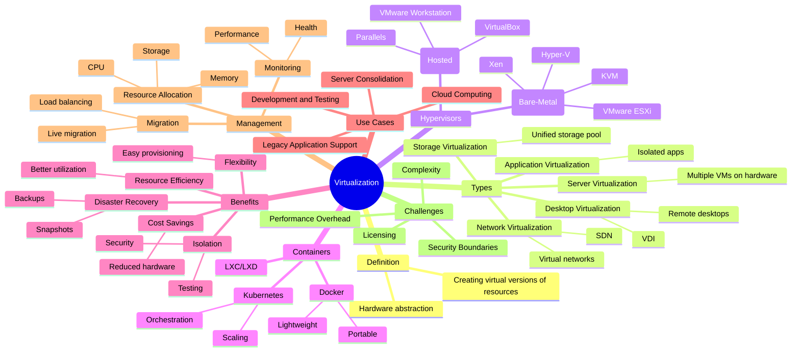

```mermaid
mindmap
  root((Virtualization))
    Definition
      Creating virtual versions of resources
      Hardware abstraction
    Types
      Server Virtualization
        Multiple VMs on hardware
      Desktop Virtualization
        VDI
        Remote desktops
      Application Virtualization
        Isolated apps
      Storage Virtualization
        Unified storage pool
      Network Virtualization
        SDN
        Virtual networks
    Hypervisors
      Type 1 (Bare-Metal)
        VMware ESXi
        Hyper-V
        KVM
        Xen
      Type 2 (Hosted)
        VirtualBox
        VMware Workstation
        Parallels
    Containers
      Docker
        Lightweight
        Portable
      Kubernetes
        Orchestration
        Scaling
      LXC/LXD
    Benefits
      Resource Efficiency
        Better utilization
      Cost Savings
        Reduced hardware
      Flexibility
        Easy provisioning
      Isolation
        Security
        Testing
      Disaster Recovery
        Snapshots
        Backups
    Use Cases
      Development and Testing
      Server Consolidation
      Cloud Computing
      Legacy Application Support
    Management
      Resource Allocation
        CPU
        Memory
        Storage
      Monitoring
        Performance
        Health
      Migration
        Live migration
        Load balancing
    Challenges
      Performance Overhead
      Licensing
      Complexity
      Security Boundaries
```

