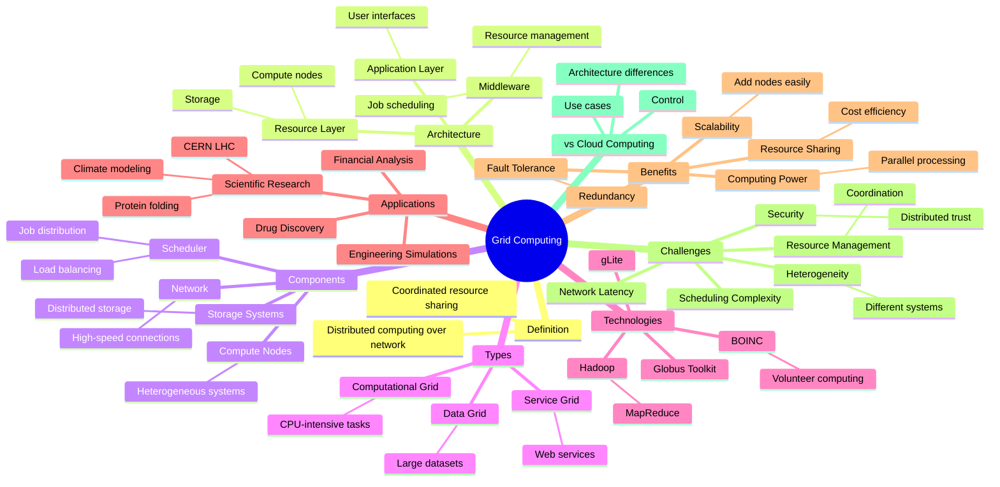

```mermaid
mindmap
  root((Grid Computing))
    Definition
      Distributed computing over network
      Coordinated resource sharing
    Architecture
      Resource Layer
        Compute nodes
        Storage
      Middleware
        Job scheduling
        Resource management
      Application Layer
        User interfaces
    Components
      Compute Nodes
        Heterogeneous systems
      Storage Systems
        Distributed storage
      Network
        High-speed connections
      Scheduler
        Job distribution
        Load balancing
    Types
      Computational Grid
        CPU-intensive tasks
      Data Grid
        Large datasets
      Service Grid
        Web services
    Technologies
      Globus Toolkit
      gLite
      BOINC
        Volunteer computing
      Hadoop
        MapReduce
    Applications
      Scientific Research
        CERN LHC
        Protein folding
        Climate modeling
      Financial Analysis
      Engineering Simulations
      Drug Discovery
    Benefits
      Computing Power
        Parallel processing
      Resource Sharing
        Cost efficiency
      Scalability
        Add nodes easily
      Fault Tolerance
        Redundancy
    Challenges
      Heterogeneity
        Different systems
      Security
        Distributed trust
      Resource Management
        Coordination
      Network Latency
      Scheduling Complexity
    vs Cloud Computing
      Architecture differences
      Use cases
      Control
```

