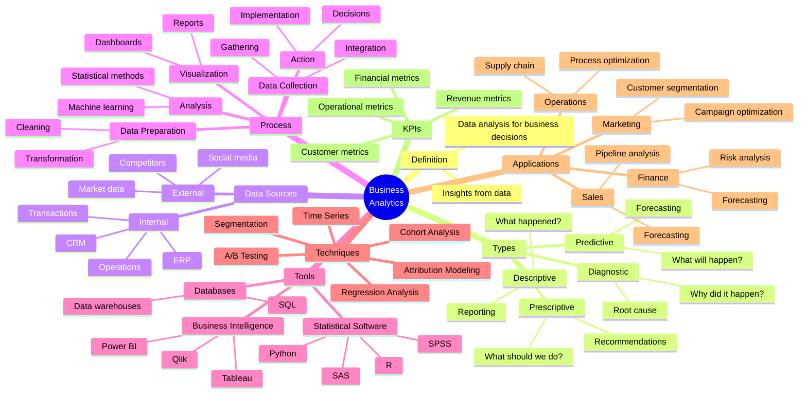

```mermaid
mindmap
  root((Business<br/>Analytics))
    Definition
      Data analysis for business decisions
      Insights from data
    Types
      Descriptive
        What happened?
        Reporting
      Diagnostic
        Why did it happen?
        Root cause
      Predictive
        What will happen?
        Forecasting
      Prescriptive
        What should we do?
        Recommendations
    Data Sources
      Internal
        Transactions
        Operations
        CRM
        ERP
      External
        Market data
        Social media
        Competitors
    Process
      Data Collection
        Gathering
        Integration
      Data Preparation
        Cleaning
        Transformation
      Analysis
        Statistical methods
        Machine learning
      Visualization
        Dashboards
        Reports
      Action
        Decisions
        Implementation
    Tools
      Business Intelligence
        Tableau
        Power BI
        Qlik
      Statistical Software
        R
        Python
        SAS
        SPSS
      Databases
        SQL
        Data warehouses
    Techniques
      Regression Analysis
      Segmentation
      Time Series
      A/B Testing
      Cohort Analysis
      Attribution Modeling
    Applications
      Marketing
        Campaign optimization
        Customer segmentation
      Finance
        Risk analysis
        Forecasting
      Operations
        Process optimization
        Supply chain
      Sales
        Pipeline analysis
        Forecasting
    KPIs
      Revenue metrics
      Customer metrics
      Operational metrics
      Financial metrics
```

