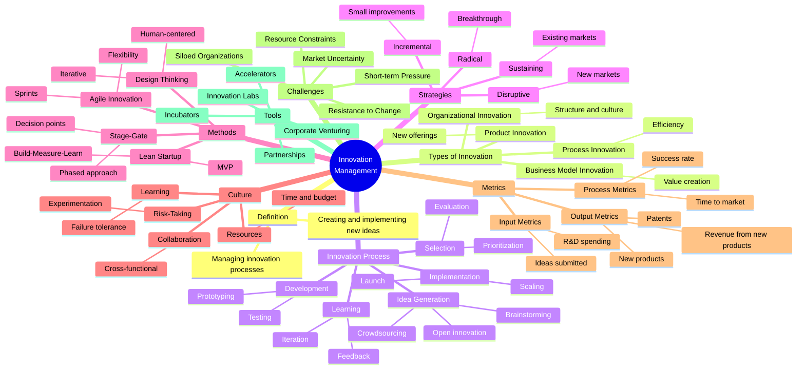

```mermaid
mindmap
  root((Innovation<br/>Management))
    Definition
      Managing innovation processes
      Creating and implementing new ideas
    Types of Innovation
      Product Innovation
        New offerings
      Process Innovation
        Efficiency
      Business Model Innovation
        Value creation
      Organizational Innovation
        Structure and culture
    Innovation Process
      Idea Generation
        Brainstorming
        Crowdsourcing
        Open innovation
      Selection
        Evaluation
        Prioritization
      Development
        Prototyping
        Testing
      Implementation
        Launch
        Scaling
      Learning
        Feedback
        Iteration
    Strategies
      Incremental
        Small improvements
      Radical
        Breakthrough
      Disruptive
        New markets
      Sustaining
        Existing markets
    Methods
      Design Thinking
        Human-centered
        Iterative
      Lean Startup
        Build-Measure-Learn
        MVP
      Stage-Gate
        Phased approach
        Decision points
      Agile Innovation
        Sprints
        Flexibility
    Culture
      Risk-Taking
        Experimentation
      Collaboration
        Cross-functional
      Learning
        Failure tolerance
      Resources
        Time and budget
    Metrics
      Input Metrics
        R&D spending
        Ideas submitted
      Process Metrics
        Time to market
        Success rate
      Output Metrics
        New products
        Revenue from new products
        Patents
    Challenges
      Resistance to Change
      Resource Constraints
      Short-term Pressure
      Siloed Organizations
      Market Uncertainty
    Tools
      Innovation Labs
      Incubators
      Accelerators
      Partnerships
      Corporate Venturing
```

