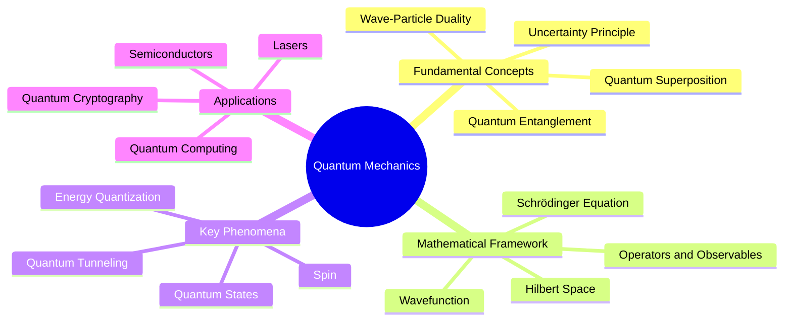

```mermaid
mindmap
  root((Quantum Mechanics))
    Fundamental Concepts
      Wave-Particle Duality
      Uncertainty Principle
      Quantum Superposition
      Quantum Entanglement
    Mathematical Framework
      Schrödinger Equation
      Wavefunction
      Operators and Observables
      Hilbert Space
    Key Phenomena
      Quantum Tunneling
      Quantum States
      Energy Quantization
      Spin
    Applications
      Quantum Computing
      Quantum Cryptography
      Lasers
      Semiconductors
```

