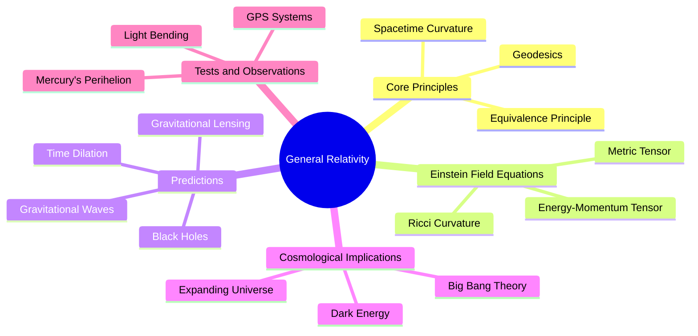

```mermaid
mindmap
  root((General Relativity))
    Core Principles
      Equivalence Principle
      Spacetime Curvature
      Geodesics
    Einstein Field Equations
      Energy-Momentum Tensor
      Metric Tensor
      Ricci Curvature
    Predictions
      Gravitational Waves
      Black Holes
      Time Dilation
      Gravitational Lensing
    Cosmological Implications
      Expanding Universe
      Big Bang Theory
      Dark Energy
    Tests and Observations
      Mercury's Perihelion
      Light Bending
      GPS Systems
```

