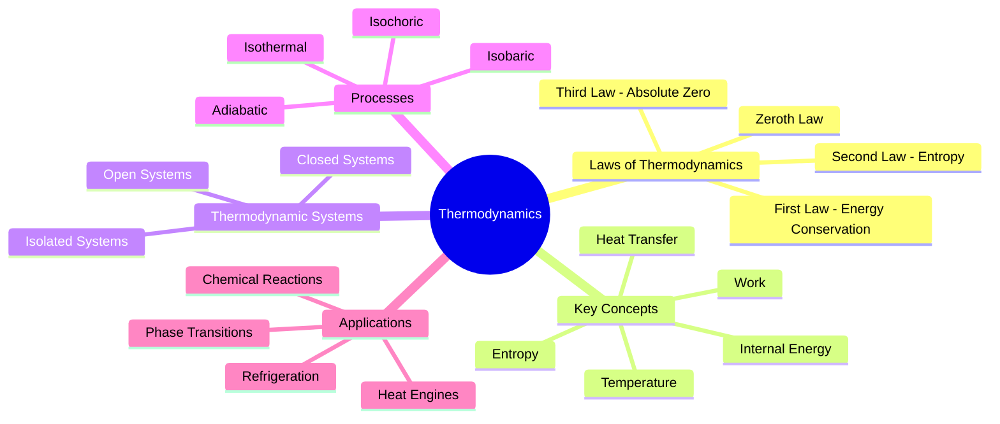

```mermaid
mindmap
  root((Thermodynamics))
    Laws of Thermodynamics
      Zeroth Law
      First Law - Energy Conservation
      Second Law - Entropy
      Third Law - Absolute Zero
    Key Concepts
      Temperature
      Heat Transfer
      Work
      Internal Energy
      Entropy
    Thermodynamic Systems
      Open Systems
      Closed Systems
      Isolated Systems
    Processes
      Isothermal
      Adiabatic
      Isobaric
      Isochoric
    Applications
      Heat Engines
      Refrigeration
      Phase Transitions
      Chemical Reactions
```

