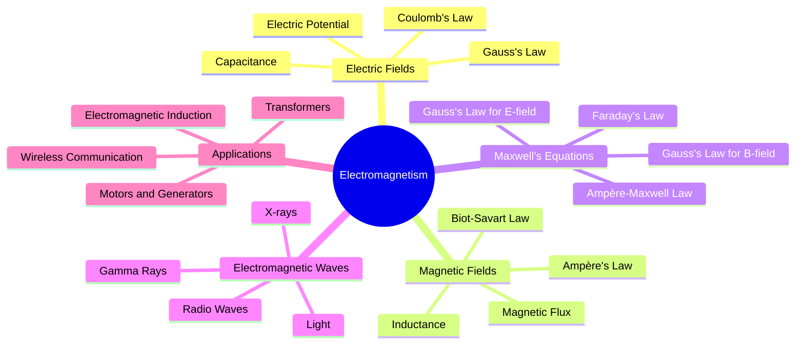

```mermaid
mindmap
  root((Electromagnetism))
    Electric Fields
      Coulomb's Law
      Electric Potential
      Gauss's Law
      Capacitance
    Magnetic Fields
      Biot-Savart Law
      Ampère's Law
      Magnetic Flux
      Inductance
    Maxwell's Equations
      Gauss's Law for E-field
      Gauss's Law for B-field
      Faraday's Law
      Ampère-Maxwell Law
    Electromagnetic Waves
      Light
      Radio Waves
      X-rays
      Gamma Rays
    Applications
      Motors and Generators
      Transformers
      Wireless Communication
      Electromagnetic Induction
```

