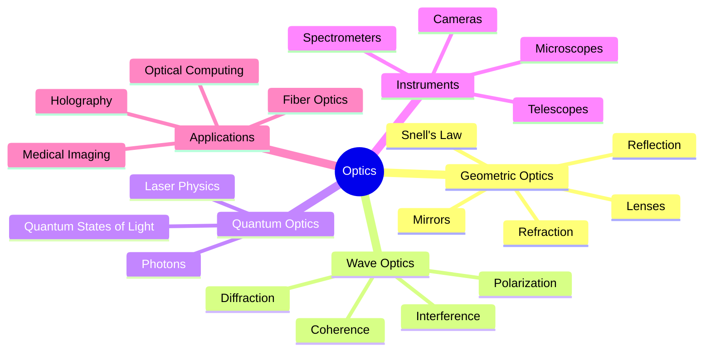

```mermaid
mindmap
  root((Optics))
    Geometric Optics
      Reflection
      Refraction
      Snell's Law
      Lenses
      Mirrors
    Wave Optics
      Interference
      Diffraction
      Polarization
      Coherence
    Quantum Optics
      Photons
      Quantum States of Light
      Laser Physics
    Instruments
      Microscopes
      Telescopes
      Spectrometers
      Cameras
    Applications
      Fiber Optics
      Holography
      Optical Computing
      Medical Imaging
```

