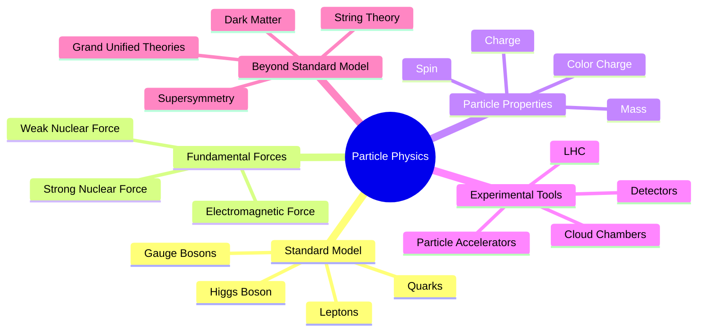

```mermaid
mindmap
  root((Particle Physics))
    Standard Model
      Quarks
      Leptons
      Gauge Bosons
      Higgs Boson
    Fundamental Forces
      Strong Nuclear Force
      Weak Nuclear Force
      Electromagnetic Force
    Particle Properties
      Mass
      Charge
      Spin
      Color Charge
    Experimental Tools
      Particle Accelerators
      Detectors
      LHC
      Cloud Chambers
    Beyond Standard Model
      Dark Matter
      Supersymmetry
      String Theory
      Grand Unified Theories
```

