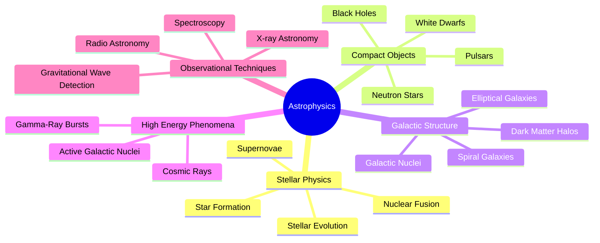

```mermaid
mindmap
  root((Astrophysics))
    Stellar Physics
      Star Formation
      Nuclear Fusion
      Stellar Evolution
      Supernovae
    Compact Objects
      White Dwarfs
      Neutron Stars
      Black Holes
      Pulsars
    Galactic Structure
      Spiral Galaxies
      Elliptical Galaxies
      Dark Matter Halos
      Galactic Nuclei
    High Energy Phenomena
      Gamma-Ray Bursts
      Active Galactic Nuclei
      Cosmic Rays
    Observational Techniques
      Spectroscopy
      Radio Astronomy
      X-ray Astronomy
      Gravitational Wave Detection
```

