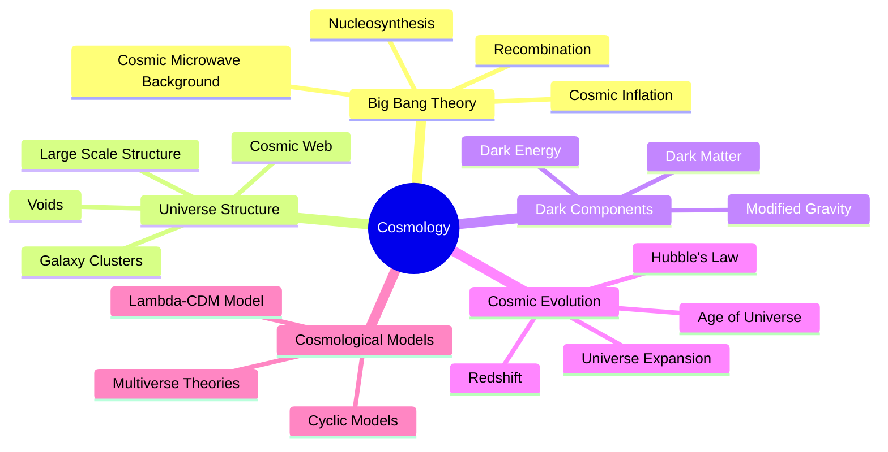

```mermaid
mindmap
  root((Cosmology))
    Big Bang Theory
      Cosmic Inflation
      Nucleosynthesis
      Recombination
      Cosmic Microwave Background
    Universe Structure
      Large Scale Structure
      Galaxy Clusters
      Cosmic Web
      Voids
    Dark Components
      Dark Matter
      Dark Energy
      Modified Gravity
    Cosmic Evolution
      Universe Expansion
      Hubble's Law
      Redshift
      Age of Universe
    Cosmological Models
      Lambda-CDM Model
      Multiverse Theories
      Cyclic Models
```

