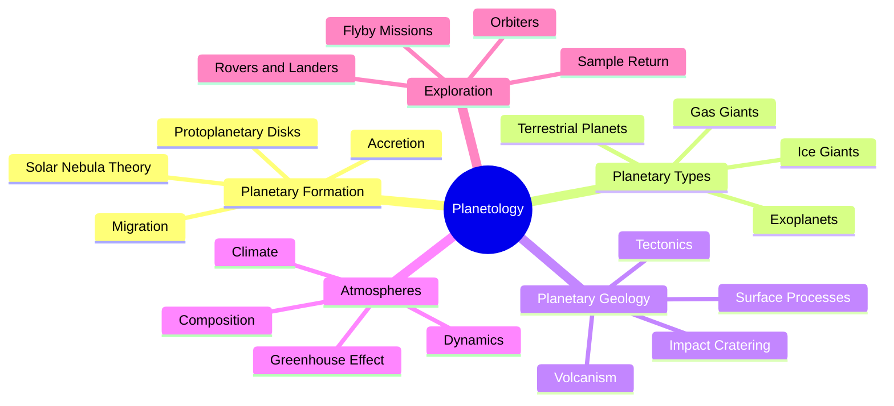

```mermaid
mindmap
  root((Planetology))
    Planetary Formation
      Protoplanetary Disks
      Accretion
      Migration
      Solar Nebula Theory
    Planetary Types
      Terrestrial Planets
      Gas Giants
      Ice Giants
      Exoplanets
    Planetary Geology
      Volcanism
      Tectonics
      Impact Cratering
      Surface Processes
    Atmospheres
      Composition
      Dynamics
      Climate
      Greenhouse Effect
    Exploration
      Rovers and Landers
      Orbiters
      Flyby Missions
      Sample Return
```

