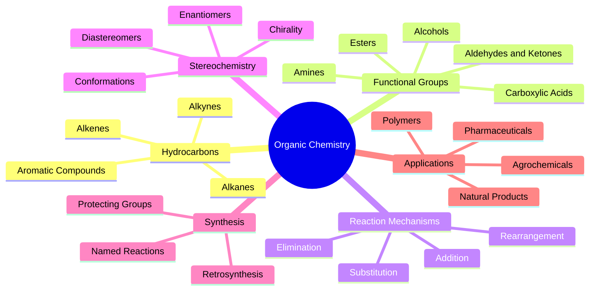

```mermaid
mindmap
  root((Organic Chemistry))
    Hydrocarbons
      Alkanes
      Alkenes
      Alkynes
      Aromatic Compounds
    Functional Groups
      Alcohols
      Aldehydes and Ketones
      Carboxylic Acids
      Amines
      Esters
    Reaction Mechanisms
      Substitution
      Elimination
      Addition
      Rearrangement
    Stereochemistry
      Chirality
      Enantiomers
      Diastereomers
      Conformations
    Synthesis
      Retrosynthesis
      Protecting Groups
      Named Reactions
    Applications
      Pharmaceuticals
      Polymers
      Natural Products
      Agrochemicals
```

