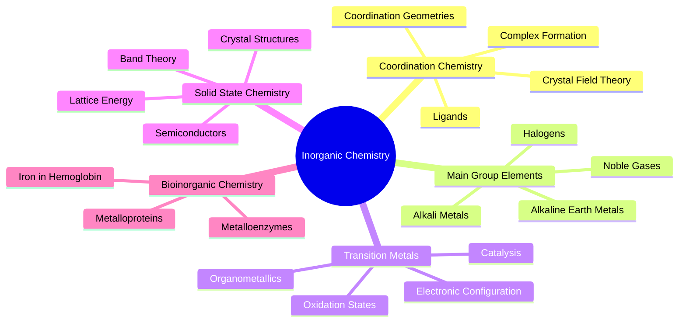

```mermaid
mindmap
  root((Inorganic Chemistry))
    Coordination Chemistry
      Ligands
      Complex Formation
      Crystal Field Theory
      Coordination Geometries
    Main Group Elements
      Alkali Metals
      Alkaline Earth Metals
      Halogens
      Noble Gases
    Transition Metals
      Electronic Configuration
      Oxidation States
      Catalysis
      Organometallics
    Solid State Chemistry
      Crystal Structures
      Lattice Energy
      Band Theory
      Semiconductors
    Bioinorganic Chemistry
      Metalloproteins
      Metalloenzymes
      Iron in Hemoglobin
```

