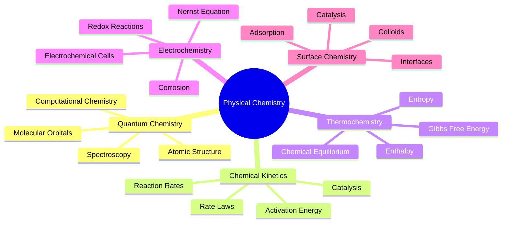

```mermaid
mindmap
  root((Physical Chemistry))
    Quantum Chemistry
      Atomic Structure
      Molecular Orbitals
      Spectroscopy
      Computational Chemistry
    Chemical Kinetics
      Reaction Rates
      Rate Laws
      Activation Energy
      Catalysis
    Thermochemistry
      Enthalpy
      Entropy
      Gibbs Free Energy
      Chemical Equilibrium
    Electrochemistry
      Redox Reactions
      Electrochemical Cells
      Nernst Equation
      Corrosion
    Surface Chemistry
      Adsorption
      Catalysis
      Colloids
      Interfaces
```

