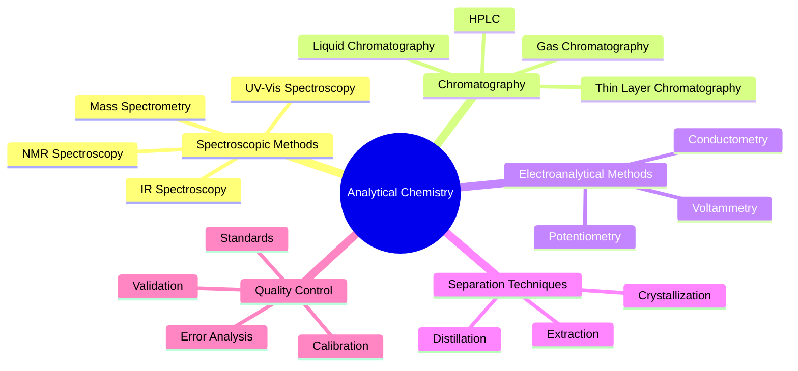

```mermaid
mindmap
  root((Analytical Chemistry))
    Spectroscopic Methods
      UV-Vis Spectroscopy
      IR Spectroscopy
      NMR Spectroscopy
      Mass Spectrometry
    Chromatography
      Gas Chromatography
      Liquid Chromatography
      HPLC
      Thin Layer Chromatography
    Electroanalytical Methods
      Potentiometry
      Voltammetry
      Conductometry
    Separation Techniques
      Extraction
      Distillation
      Crystallization
    Quality Control
      Calibration
      Validation
      Error Analysis
      Standards
```

