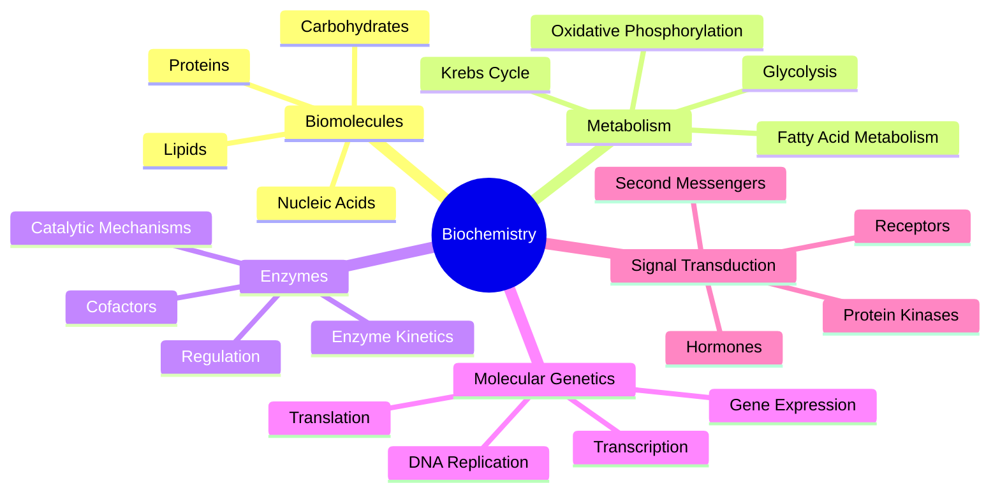

```mermaid
mindmap
  root((Biochemistry))
    Biomolecules
      Proteins
      Carbohydrates
      Lipids
      Nucleic Acids
    Metabolism
      Glycolysis
      Krebs Cycle
      Oxidative Phosphorylation
      Fatty Acid Metabolism
    Enzymes
      Catalytic Mechanisms
      Enzyme Kinetics
      Regulation
      Cofactors
    Molecular Genetics
      DNA Replication
      Transcription
      Translation
      Gene Expression
    Signal Transduction
      Receptors
      Second Messengers
      Protein Kinases
      Hormones
```

