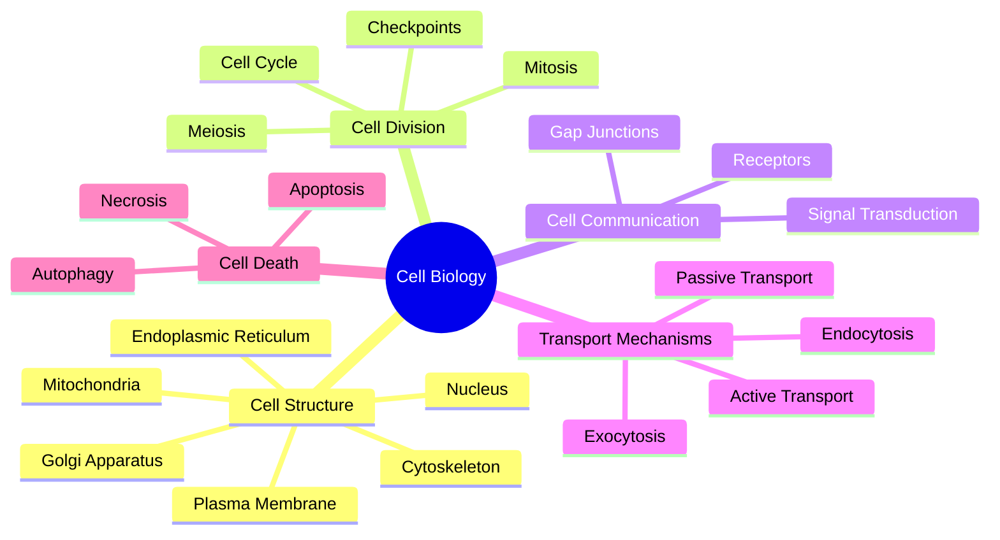

```mermaid
mindmap
  root((Cell Biology))
    Cell Structure
      Plasma Membrane
      Nucleus
      Mitochondria
      Endoplasmic Reticulum
      Golgi Apparatus
      Cytoskeleton
    Cell Division
      Mitosis
      Meiosis
      Cell Cycle
      Checkpoints
    Cell Communication
      Signal Transduction
      Gap Junctions
      Receptors
    Transport Mechanisms
      Passive Transport
      Active Transport
      Endocytosis
      Exocytosis
    Cell Death
      Apoptosis
      Necrosis
      Autophagy
```

