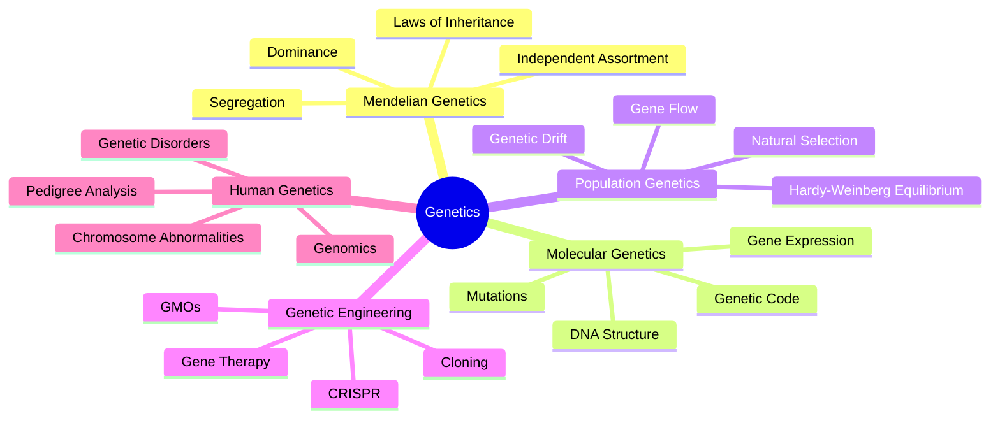

```mermaid
mindmap
  root((Genetics))
    Mendelian Genetics
      Laws of Inheritance
      Dominance
      Segregation
      Independent Assortment
    Molecular Genetics
      DNA Structure
      Gene Expression
      Mutations
      Genetic Code
    Population Genetics
      Hardy-Weinberg Equilibrium
      Genetic Drift
      Gene Flow
      Natural Selection
    Genetic Engineering
      CRISPR
      Cloning
      GMOs
      Gene Therapy
    Human Genetics
      Pedigree Analysis
      Genetic Disorders
      Chromosome Abnormalities
      Genomics
```

