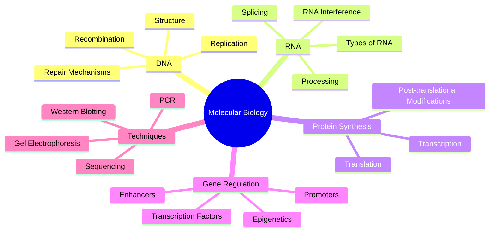

```mermaid
mindmap
  root((Molecular Biology))
    DNA
      Structure
      Replication
      Repair Mechanisms
      Recombination
    RNA
      Types of RNA
      Processing
      Splicing
      RNA Interference
    Protein Synthesis
      Transcription
      Translation
      Post-translational Modifications
    Gene Regulation
      Promoters
      Enhancers
      Transcription Factors
      Epigenetics
    Techniques
      PCR
      Sequencing
      Gel Electrophoresis
      Western Blotting
```

