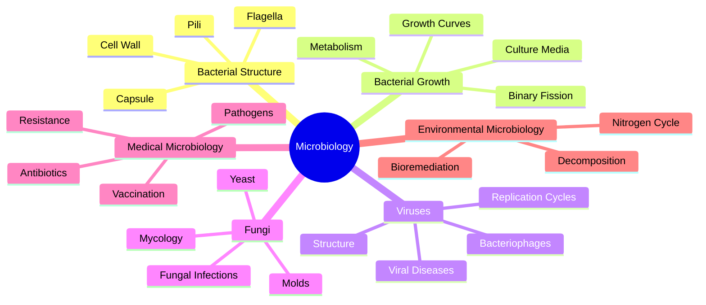

```mermaid
mindmap
  root((Microbiology))
    Bacterial Structure
      Cell Wall
      Flagella
      Pili
      Capsule
    Bacterial Growth
      Binary Fission
      Growth Curves
      Culture Media
      Metabolism
    Viruses
      Structure
      Replication Cycles
      Viral Diseases
      Bacteriophages
    Fungi
      Yeast
      Molds
      Mycology
      Fungal Infections
    Medical Microbiology
      Pathogens
      Antibiotics
      Resistance
      Vaccination
    Environmental Microbiology
      Nitrogen Cycle
      Decomposition
      Bioremediation
```

