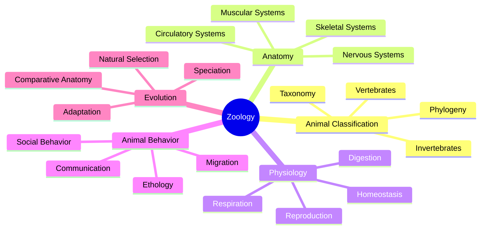

```mermaid
mindmap
  root((Zoology))
    Animal Classification
      Invertebrates
      Vertebrates
      Taxonomy
      Phylogeny
    Anatomy
      Skeletal Systems
      Muscular Systems
      Nervous Systems
      Circulatory Systems
    Physiology
      Respiration
      Digestion
      Reproduction
      Homeostasis
    Animal Behavior
      Ethology
      Social Behavior
      Communication
      Migration
    Evolution
      Adaptation
      Speciation
      Natural Selection
      Comparative Anatomy
```

