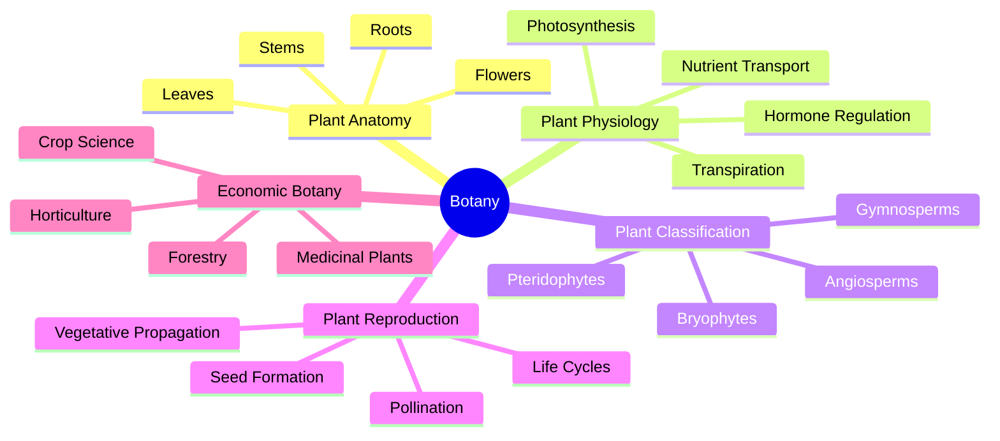

```mermaid
mindmap
  root((Botany))
    Plant Anatomy
      Roots
      Stems
      Leaves
      Flowers
    Plant Physiology
      Photosynthesis
      Transpiration
      Nutrient Transport
      Hormone Regulation
    Plant Classification
      Bryophytes
      Pteridophytes
      Gymnosperms
      Angiosperms
    Plant Reproduction
      Pollination
      Seed Formation
      Vegetative Propagation
      Life Cycles
    Economic Botany
      Crop Science
      Medicinal Plants
      Forestry
      Horticulture
```

