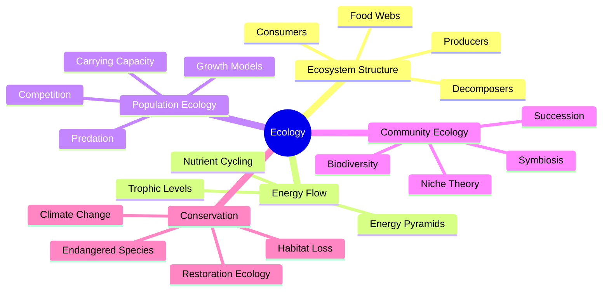

```mermaid
mindmap
  root((Ecology))
    Ecosystem Structure
      Producers
      Consumers
      Decomposers
      Food Webs
    Energy Flow
      Trophic Levels
      Energy Pyramids
      Nutrient Cycling
    Population Ecology
      Growth Models
      Carrying Capacity
      Competition
      Predation
    Community Ecology
      Succession
      Biodiversity
      Symbiosis
      Niche Theory
    Conservation
      Habitat Loss
      Climate Change
      Endangered Species
      Restoration Ecology
```

