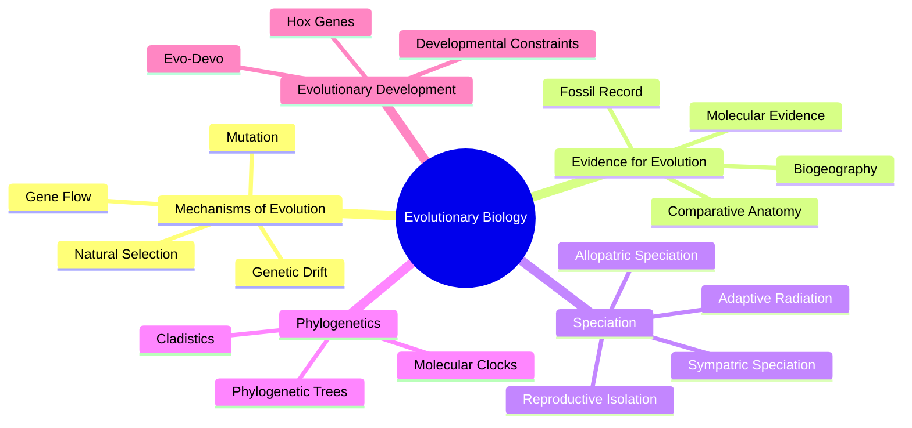

```mermaid
mindmap
  root((Evolutionary Biology))
    Mechanisms of Evolution
      Natural Selection
      Genetic Drift
      Gene Flow
      Mutation
    Evidence for Evolution
      Fossil Record
      Comparative Anatomy
      Molecular Evidence
      Biogeography
    Speciation
      Allopatric Speciation
      Sympatric Speciation
      Reproductive Isolation
      Adaptive Radiation
    Phylogenetics
      Cladistics
      Phylogenetic Trees
      Molecular Clocks
    Evolutionary Development
      Evo-Devo
      Hox Genes
      Developmental Constraints
```

