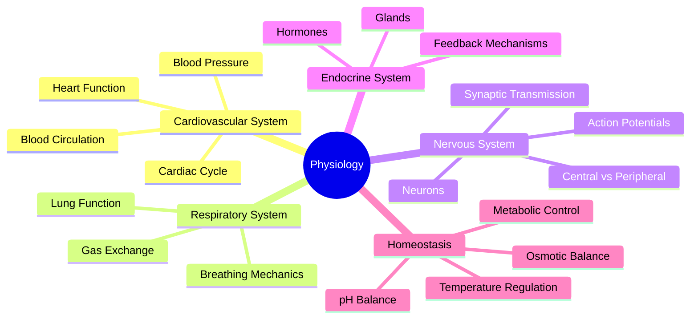

```mermaid
mindmap
  root((Physiology))
    Cardiovascular System
      Heart Function
      Blood Circulation
      Blood Pressure
      Cardiac Cycle
    Respiratory System
      Gas Exchange
      Lung Function
      Breathing Mechanics
    Nervous System
      Neurons
      Action Potentials
      Synaptic Transmission
      Central vs Peripheral
    Endocrine System
      Hormones
      Glands
      Feedback Mechanisms
    Homeostasis
      Temperature Regulation
      pH Balance
      Osmotic Balance
      Metabolic Control
```

