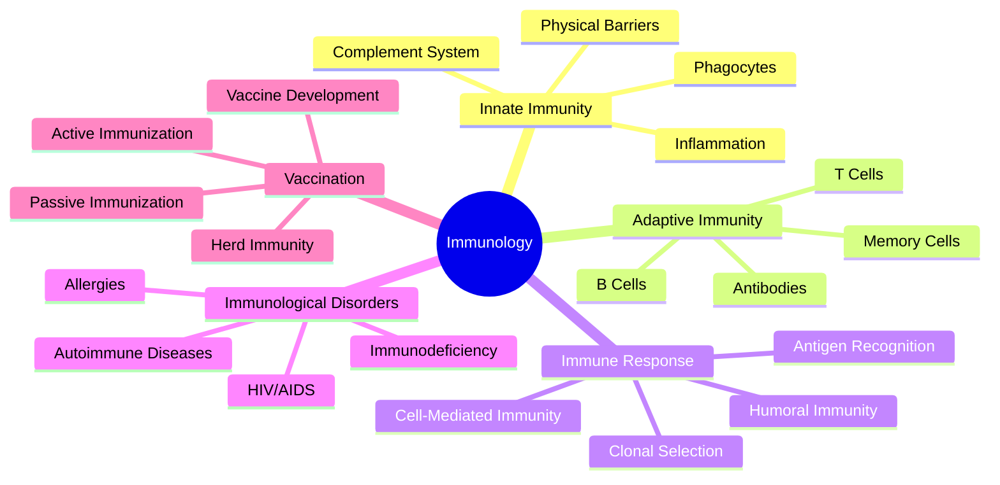

```mermaid
mindmap
  root((Immunology))
    Innate Immunity
      Physical Barriers
      Inflammation
      Phagocytes
      Complement System
    Adaptive Immunity
      B Cells
      T Cells
      Antibodies
      Memory Cells
    Immune Response
      Antigen Recognition
      Clonal Selection
      Humoral Immunity
      Cell-Mediated Immunity
    Immunological Disorders
      Autoimmune Diseases
      Allergies
      Immunodeficiency
      HIV/AIDS
    Vaccination
      Active Immunization
      Passive Immunization
      Vaccine Development
      Herd Immunity
```

