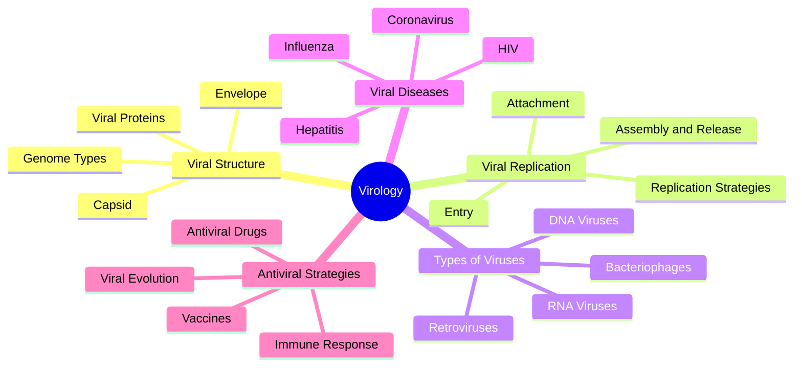

```mermaid
mindmap
  root((Virology))
    Viral Structure
      Capsid
      Envelope
      Genome Types
      Viral Proteins
    Viral Replication
      Attachment
      Entry
      Replication Strategies
      Assembly and Release
    Types of Viruses
      DNA Viruses
      RNA Viruses
      Retroviruses
      Bacteriophages
    Viral Diseases
      Influenza
      HIV
      Coronavirus
      Hepatitis
    Antiviral Strategies
      Antiviral Drugs
      Vaccines
      Immune Response
      Viral Evolution
```

