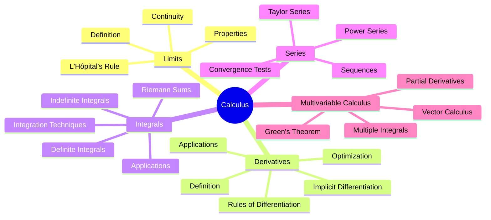

```mermaid
mindmap
  root((Calculus))
    Limits
      Definition
      Properties
      Continuity
      L'Hôpital's Rule
    Derivatives
      Definition
      Rules of Differentiation
      Applications
      Implicit Differentiation
      Optimization
    Integrals
      Riemann Sums
      Definite Integrals
      Indefinite Integrals
      Integration Techniques
      Applications
    Series
      Sequences
      Convergence Tests
      Power Series
      Taylor Series
    Multivariable Calculus
      Partial Derivatives
      Multiple Integrals
      Vector Calculus
      Green's Theorem
```

