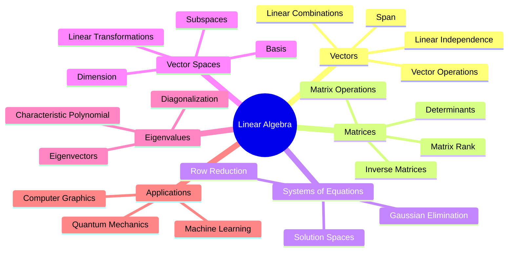

```mermaid
mindmap
  root((Linear Algebra))
    Vectors
      Vector Operations
      Linear Combinations
      Span
      Linear Independence
    Matrices
      Matrix Operations
      Determinants
      Inverse Matrices
      Matrix Rank
    Systems of Equations
      Gaussian Elimination
      Row Reduction
      Solution Spaces
    Vector Spaces
      Subspaces
      Basis
      Dimension
      Linear Transformations
    Eigenvalues
      Eigenvectors
      Diagonalization
      Characteristic Polynomial
    Applications
      Computer Graphics
      Machine Learning
      Quantum Mechanics
```

