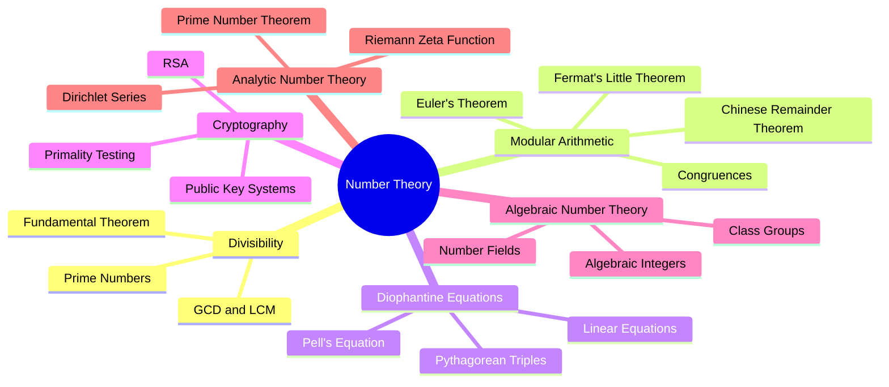

```mermaid
mindmap
  root((Number Theory))
    Divisibility
      Prime Numbers
      GCD and LCM
      Fundamental Theorem
    Modular Arithmetic
      Congruences
      Chinese Remainder Theorem
      Euler's Theorem
      Fermat's Little Theorem
    Diophantine Equations
      Linear Equations
      Pythagorean Triples
      Pell's Equation
    Cryptography
      RSA
      Public Key Systems
      Primality Testing
    Algebraic Number Theory
      Algebraic Integers
      Number Fields
      Class Groups
    Analytic Number Theory
      Prime Number Theorem
      Riemann Zeta Function
      Dirichlet Series
```

