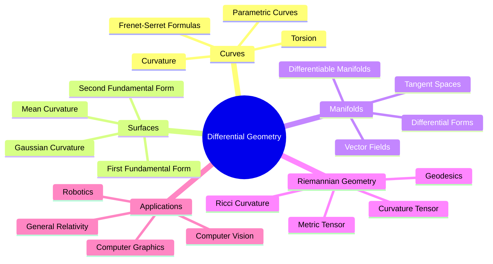

```mermaid
mindmap
  root((Differential Geometry))
    Curves
      Parametric Curves
      Curvature
      Torsion
      Frenet-Serret Formulas
    Surfaces
      First Fundamental Form
      Second Fundamental Form
      Gaussian Curvature
      Mean Curvature
    Manifolds
      Differentiable Manifolds
      Tangent Spaces
      Vector Fields
      Differential Forms
    Riemannian Geometry
      Metric Tensor
      Geodesics
      Curvature Tensor
      Ricci Curvature
    Applications
      General Relativity
      Computer Graphics
      Robotics
      Computer Vision
```

