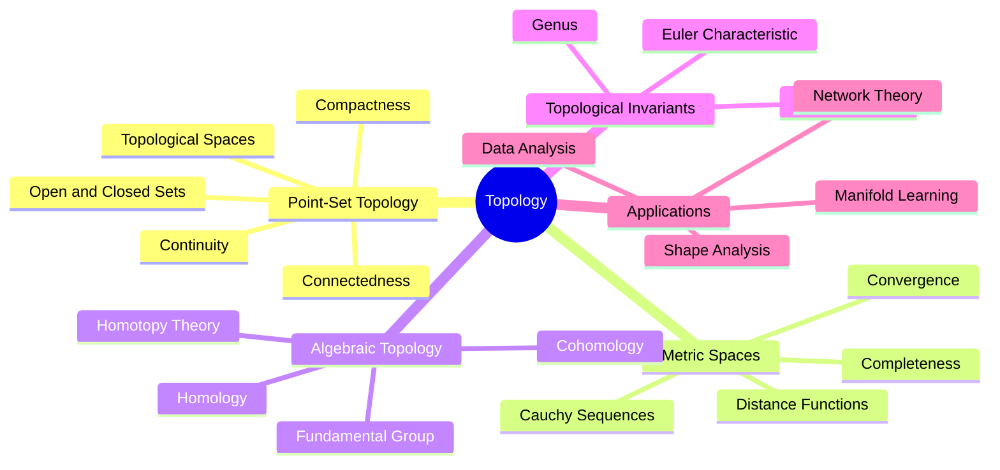

```mermaid
mindmap
  root((Topology))
    Point-Set Topology
      Topological Spaces
      Open and Closed Sets
      Continuity
      Compactness
      Connectedness
    Metric Spaces
      Distance Functions
      Convergence
      Completeness
      Cauchy Sequences
    Algebraic Topology
      Fundamental Group
      Homology
      Cohomology
      Homotopy Theory
    Topological Invariants
      Euler Characteristic
      Betti Numbers
      Genus
    Applications
      Data Analysis
      Manifold Learning
      Shape Analysis
      Network Theory
```

