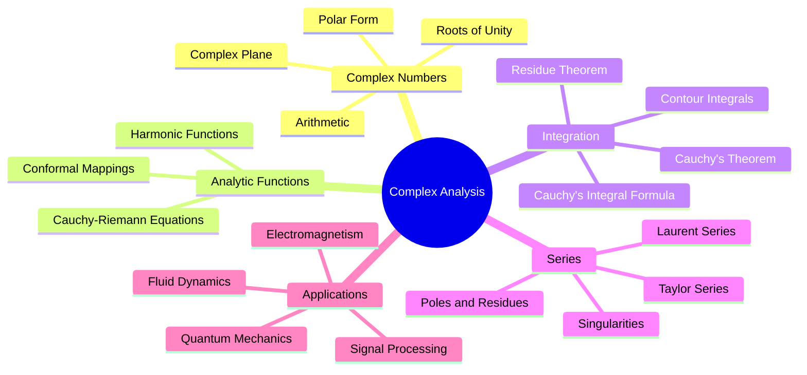

```mermaid
mindmap
  root((Complex Analysis))
    Complex Numbers
      Arithmetic
      Polar Form
      Roots of Unity
      Complex Plane
    Analytic Functions
      Cauchy-Riemann Equations
      Harmonic Functions
      Conformal Mappings
    Integration
      Contour Integrals
      Cauchy's Theorem
      Cauchy's Integral Formula
      Residue Theorem
    Series
      Taylor Series
      Laurent Series
      Singularities
      Poles and Residues
    Applications
      Fluid Dynamics
      Electromagnetism
      Signal Processing
      Quantum Mechanics
```

