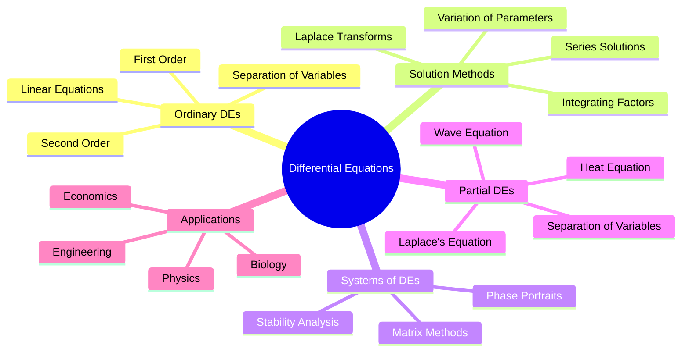

```mermaid
mindmap
  root((Differential Equations))
    Ordinary DEs
      First Order
      Second Order
      Linear Equations
      Separation of Variables
    Solution Methods
      Integrating Factors
      Variation of Parameters
      Laplace Transforms
      Series Solutions
    Systems of DEs
      Matrix Methods
      Phase Portraits
      Stability Analysis
    Partial DEs
      Wave Equation
      Heat Equation
      Laplace's Equation
      Separation of Variables
    Applications
      Physics
      Engineering
      Biology
      Economics
```

