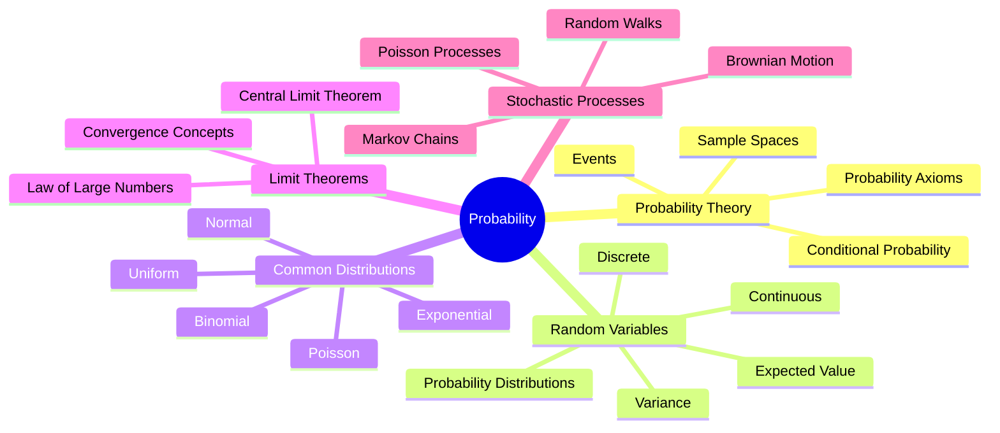

```mermaid
mindmap
  root((Probability))
    Probability Theory
      Sample Spaces
      Events
      Probability Axioms
      Conditional Probability
    Random Variables
      Discrete
      Continuous
      Probability Distributions
      Expected Value
      Variance
    Common Distributions
      Binomial
      Poisson
      Normal
      Exponential
      Uniform
    Limit Theorems
      Law of Large Numbers
      Central Limit Theorem
      Convergence Concepts
    Stochastic Processes
      Markov Chains
      Random Walks
      Poisson Processes
      Brownian Motion
```

