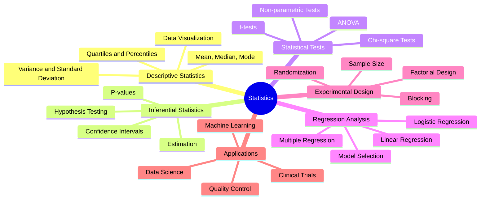

```mermaid
mindmap
  root((Statistics))
    Descriptive Statistics
      Mean, Median, Mode
      Variance and Standard Deviation
      Quartiles and Percentiles
      Data Visualization
    Inferential Statistics
      Estimation
      Confidence Intervals
      Hypothesis Testing
      P-values
    Statistical Tests
      t-tests
      Chi-square Tests
      ANOVA
      Non-parametric Tests
    Regression Analysis
      Linear Regression
      Multiple Regression
      Logistic Regression
      Model Selection
    Experimental Design
      Randomization
      Blocking
      Factorial Design
      Sample Size
    Applications
      Data Science
      Machine Learning
      Quality Control
      Clinical Trials
```

