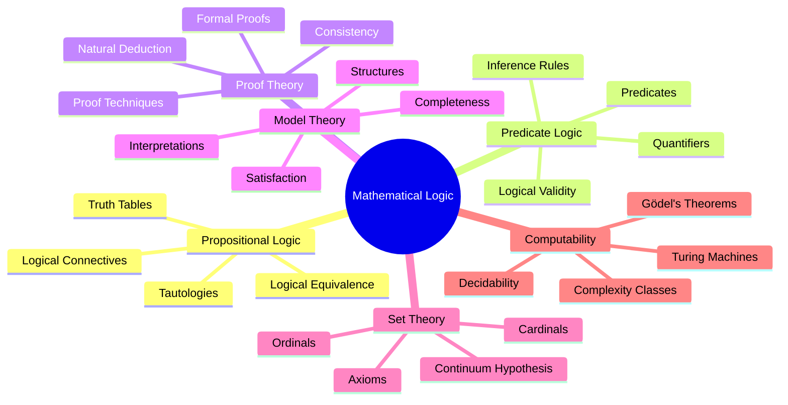

```mermaid
mindmap
  root((Mathematical Logic))
    Propositional Logic
      Logical Connectives
      Truth Tables
      Tautologies
      Logical Equivalence
    Predicate Logic
      Quantifiers
      Predicates
      Inference Rules
      Logical Validity
    Proof Theory
      Natural Deduction
      Formal Proofs
      Proof Techniques
      Consistency
    Model Theory
      Structures
      Interpretations
      Satisfaction
      Completeness
    Set Theory
      Axioms
      Ordinals
      Cardinals
      Continuum Hypothesis
    Computability
      Turing Machines
      Decidability
      Gödel's Theorems
      Complexity Classes
```

