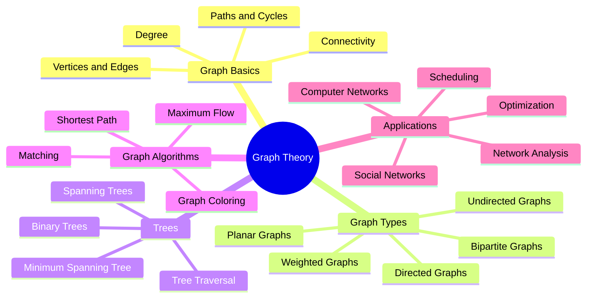

```mermaid
mindmap
  root((Graph Theory))
    Graph Basics
      Vertices and Edges
      Degree
      Paths and Cycles
      Connectivity
    Graph Types
      Directed Graphs
      Undirected Graphs
      Weighted Graphs
      Planar Graphs
      Bipartite Graphs
    Trees
      Spanning Trees
      Binary Trees
      Tree Traversal
      Minimum Spanning Tree
    Graph Algorithms
      Shortest Path
      Maximum Flow
      Graph Coloring
      Matching
    Applications
      Network Analysis
      Social Networks
      Computer Networks
      Scheduling
      Optimization
```

