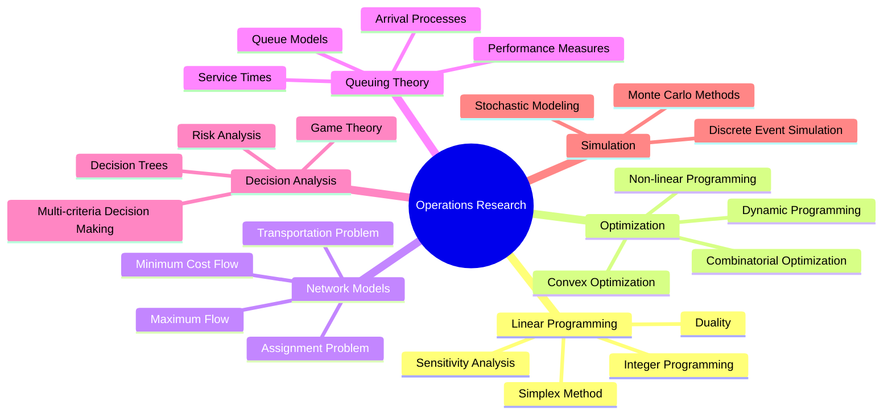

```mermaid
mindmap
  root((Operations Research))
    Linear Programming
      Simplex Method
      Duality
      Sensitivity Analysis
      Integer Programming
    Optimization
      Convex Optimization
      Non-linear Programming
      Dynamic Programming
      Combinatorial Optimization
    Network Models
      Maximum Flow
      Minimum Cost Flow
      Transportation Problem
      Assignment Problem
    Queuing Theory
      Queue Models
      Arrival Processes
      Service Times
      Performance Measures
    Decision Analysis
      Decision Trees
      Game Theory
      Multi-criteria Decision Making
      Risk Analysis
    Simulation
      Monte Carlo Methods
      Discrete Event Simulation
      Stochastic Modeling
```

