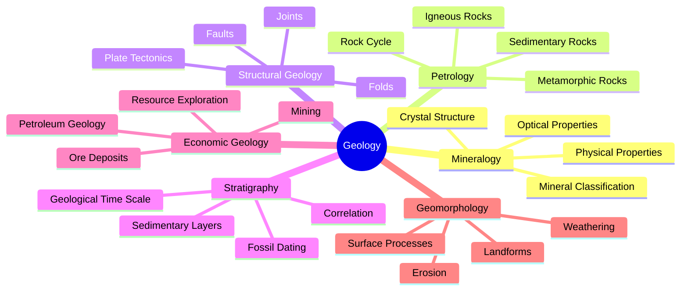

```mermaid
mindmap
  root((Geology))
    Mineralogy
      Crystal Structure
      Mineral Classification
      Physical Properties
      Optical Properties
    Petrology
      Igneous Rocks
      Sedimentary Rocks
      Metamorphic Rocks
      Rock Cycle
    Structural Geology
      Folds
      Faults
      Joints
      Plate Tectonics
    Stratigraphy
      Sedimentary Layers
      Geological Time Scale
      Correlation
      Fossil Dating
    Economic Geology
      Ore Deposits
      Petroleum Geology
      Mining
      Resource Exploration
    Geomorphology
      Erosion
      Weathering
      Landforms
      Surface Processes
```

