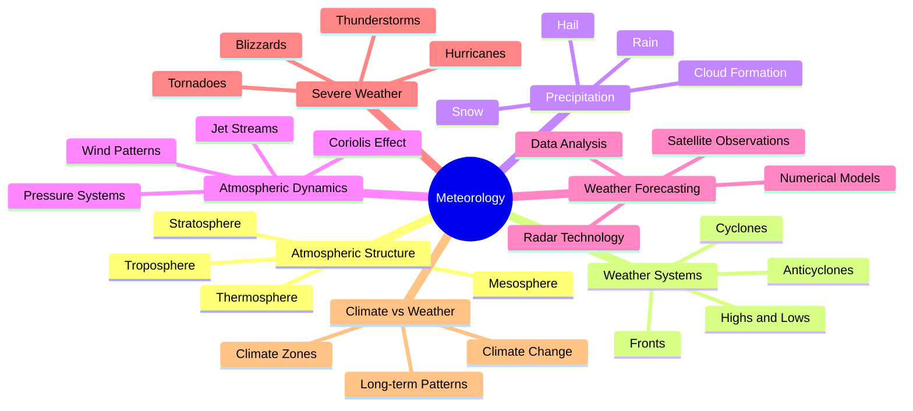

```mermaid
mindmap
  root((Meteorology))
    Atmospheric Structure
      Troposphere
      Stratosphere
      Mesosphere
      Thermosphere
    Weather Systems
      Highs and Lows
      Fronts
      Cyclones
      Anticyclones
    Precipitation
      Rain
      Snow
      Hail
      Cloud Formation
    Atmospheric Dynamics
      Wind Patterns
      Jet Streams
      Coriolis Effect
      Pressure Systems
    Weather Forecasting
      Numerical Models
      Satellite Observations
      Radar Technology
      Data Analysis
    Severe Weather
      Thunderstorms
      Tornadoes
      Hurricanes
      Blizzards
    Climate vs Weather
      Climate Zones
      Climate Change
      Long-term Patterns
```

